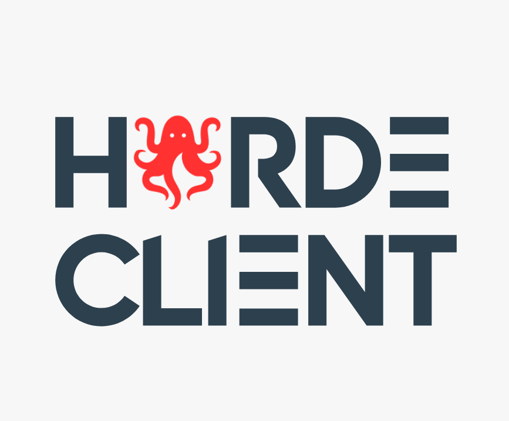

{h=200 w=230 align=center}

  <p align="center">
    Easy-to-use Python Interface for KoboldAI Horde.
    <!-- <br />
    <a href="#"><strong>Explore the docs »</strong></a>
    <br /> -->
    <br />
    <!-- <a href="#">View Demo</a> -->
    <!-- · -->
    <a href="https://github.com/rahuldshetty/horde-client/issues">Report Bug</a>
    ·
    <a href="https://github.com/rahuldshetty/horde-client/issues">Request Feature</a>
  </p>
</div>

<!-- ABOUT THE PROJECT -->
## About

<!-- [![Product Name Screen Shot][product-screenshot]](https://example.com) -->

This project provides Python Client to interact with [KoboldAI Horde](https://horde.koboldai.net) service, which is a crowdsourced distributed cluster program that offers Image generation and Text Generation workers. Through this utility package, you can leverage these services from your application. 

* Simple & Easy-to-use.
* Support for Text Generation & Image Generation (WIP).
* More Examples! (on the way)

> Note: There is an official Python SDK under development from Haidra-org: https://github.com/Haidra-Org/horde-sdk.

> Security Note: Do NOT send any private information while connecting to the public KoboldAI service. There is no control on how the data is processed. However, if you have private & secured KoboldAI Endpoints then feel free to experiment yourself. 

<!-- Installation -->
## Quickstart

Install Horde Client with pip: 

`pip install horde-client`

Sample Code:

```python
from horde_client import HordeClient, TextGenParams

# Initialize Client
client = HordeClient()

# Prompt
prompt =  """### Instruction: 
Tell me a knock knock joke.

### Response:
"""

# Setup Text Generation Parameters
params = TextGenParams(
    max_context_length = 512,
    temperature=0.8
)

# Run Generation (Sync)
text_gen_ouput = client.text_gen(prompt, params=params)

print(text_gen_ouput.generations[0].text)
# Knock knock!
# Who's there?
# Interrupting cow.
# Interrupting cow who?
# Mooooooo!
```

<!-- ROADMAP -->
## Roadmap

- [X] Text Generation Support
- [ ] Image Generation Support
- [ ] Asynchronous Client
- [ ] Readthedocs integration
- [ ] Tests

Missing Something? Raise a [request](https://github.com/rahuldshetty/horde-client/issues) 

